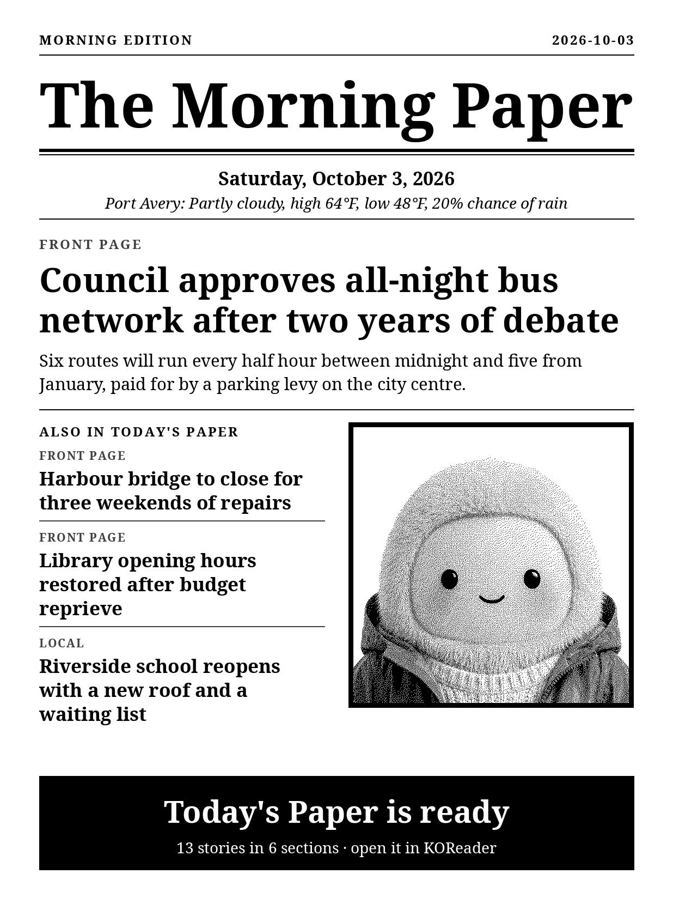

# MNN: Muse News Network

[](https://github.com/JoshuaHayesWasHere/MNN/actions/workflows/check.yml)
[](LICENSE)

A daily newspaper written by your AI agent and delivered to your e-reader.
Each morning the Kindle wakes to a front page, and the day's full edition is
already downloaded and waiting in KOReader.

<p align="center">
  
</p>
<p align="center"><sub>The front page, as the Kindle draws it on wake. Built from the sample edition with an optional portrait.</sub></p>

An AI editor is built in. Give the Press a Claude API key and a sentence
about what you care about, and each morning it reads your feeds, chooses the
few stories that matter to you, and writes them up with a line on why. Or
bring your own agent: it can write a whole edition, a single section, or the
answer to a question the Press puts to it at print time. MNN is the press. It
lays the paper out for e-ink, prints it, and gets it onto the Kindle.

- **An editor built in.** One API key, and Claude chooses and writes your
  front page from your feeds, to a brief in your own words.
- **Your day on the front page.** Point it at your calendar and the paper
  opens with today's agenda and a few sentences on how the day is shaped.
- **Or written by your own agent.** Anything that can write a JSON file or
  make an HTTP request can write for the paper.
- **Laid out for e-ink.** A front page the Kindle draws on wake, and an EPUB
  with a contents page and a way back from every story.
- **One line to install** on a Raspberry Pi or any Debian or Ubuntu machine,
  and one file to copy onto the Kindle.
- **Self-hosted.** The Press runs on your network, with no account and no
  settings needed.

It targets a Kindle Paperwhite 11 (1236x1648, 300 ppi) with KOReader.

## Try it in two minutes

No e-reader needed. With Docker installed:

```sh
git clone https://github.com/JoshuaHayesWasHere/MNN.git && cd MNN
make up
```

Then open <http://localhost:8484/>. The Press prints its first paper within a
minute or two, and the page shows the front page, with the paper to download
and the ways to get it onto a reader.

## Install

On a Raspberry Pi running the 64-bit Raspberry Pi OS, or any Debian or Ubuntu
machine on the same network as the Kindle:

```sh
curl -fsSL https://raw.githubusercontent.com/JoshuaHayesWasHere/MNN/main/install.sh | sh
```

[install.sh](install.sh) asks no questions. It installs Docker if it is
missing, puts the Press in `~/mnn`, starts it, and prints the Press's address
and what to do on the Kindle next. It uses sudo only where root is
needed. Run it again at any time to update. To use a port other than 8484,
end the line with `| sh -s -- --port 9000`; `--help` lists the rest.

Then point a Kindle at it, with nothing to type on the Kindle:

1. On a computer, open `http://<press-address>:8484/kindle/install.sh?download`
   and save the file into the Kindle's `documents` folder over USB.
2. In KOReader's file browser, long-press `Install MNN.sh` and choose
   **Execute**.

Or type one line in KOReader's terminal:

```sh
curl http://<press-address>:8484/kindle/install.sh | sh
```

From then on the Kindle wakes itself five minutes after the edition time
(06:40 by default), downloads the paper into KOReader's library and draws the
front page. See [kindle/README.md](kindle/README.md) for what it installs. To
read a paper without installing anything on the Kindle, add the OPDS catalog
`http://<press-address>:8484/opds` in KOReader.

Working from a clone instead? `make up` builds and starts the same thing,
and `make help` lists the rest:

```sh
make up        # build and start the Press
make status    # did today's paper print, and has the Kindle collected it?
make reprint   # print today's paper again
make test      # run the tests
```

[Running and asking the Press](docs/press.md) covers the settings, and
running without Docker.

## How it fits together

```
    sources              the Press            Kindle
 (your agent,     ->   (a container)   ->   (your LAN)
  news feeds,         Pi, NAS, mini-PC,
  your modules)       or any Docker host
```

- **Sources write the sections.** Each section of the paper comes from a
  source: your agent, a set of news feeds, or a module of your own. They are
  listed in `sources.toml`.
- **The Press assembles and prints.** At edition time it runs every source,
  merges whatever came back into one edition, renders the EPUB and the front
  page, and serves them on the LAN. It is one container that runs the same on
  a Raspberry Pi, a NAS, a mini-PC, or anything else with Docker, on arm64 or
  amd64.
- **The Kindle reads.** It downloads from the Press and logs that it did.

A source that fails loses only its own section; the rest of the paper prints.
If nothing can be printed, yesterday's paper stays where it was and the Press
tries again.

## Turn on the editor

The default paper's front page is written by the built-in editor as soon as
the Press has a key. In `~/mnn/.env` (or `.env` in your clone):

```sh
ANTHROPIC_API_KEY=sk-ant-...
```

then run the installer again, or `make restart`. To tell it what you care
about, copy `sources.toml` into `config/` and edit the `brief`:

```toml
[[section]]
title = "Front Page"
source = "editor"
feeds = ["https://feeds.bbci.co.uk/news/rss.xml", "https://www.theguardian.com/world/rss"]
stories = 4
brief = "I follow AI research and local transport. Skip sport and celebrity."
timeout = 180
```

The editor only chooses among stories your feeds carried and writes from
their summaries; the links and bylines printed are always the feed's.
[The editor](docs/sources.md#the-editor) has the settings, the cost and what
leaves your network.

## Put your day in it

Give the paper your calendar's private `.ics` address and it opens with you:

```toml
[[section]]
title = "Your Day"
source = "day"
calendars = ["https://calendar.google.com/calendar/ical/.../basic.ics"]
brief = "I work from home on Tuesdays. The school run is mine."
timeout = 120
```

The agenda is printed exactly as the calendar has it. With a key, Claude
writes a short piece above it on where the day's weight falls. A day with
nothing on has no such section. [Your day](docs/sources.md#your-day) has the
details, and what it means for privacy.

## Let your own agent write it

An agent of your own has three ways in, from least to most set-up:

| Way | The agent | Works with |
| --- | --- | --- |
| [The inbox](docs/sources.md#the-inbox) | leaves a section as a JSON file in a folder; the next paper prints it | Any agent that can write a file |
| [Staging](docs/staging.md) | writes the whole edition and uploads it; the Press prints that and sends a receipt back | Any agent that can make an HTTP request, on any machine |
| [A question at print time](docs/muse.md#asking-muse-at-print-time) | is asked by the Press as the paper is put together, and its answer is printed | Muse today, and experimental |

The inbox is the place to start. Give it a section in `config/sources.toml`:

```toml
[[section]]
title = "From Your Agent"
source = "inbox"
```

and have your agent leave a file named for the day, such as
`inbox/2026-10-05.json`:

```json
{
  "title": "From Your Agent",
  "articles": [
    {
      "title": "Three things for Monday",
      "body": [
        "The dentist is at 14:30, and the car is due back by five.",
        "Rain from mid-afternoon, so the walk is better before lunch."
      ]
    }
  ]
}
```

What you ask your agent to write is set in your agent, never in this
repository.

## Add news feeds

A section can also come straight from RSS and Atom feeds, unedited. A fresh
install starts with a few, and until the Press has a key its front page is
printed that way too. To choose them, copy the default into `config/` and
edit the copy:

```sh
cp sources.toml config/sources.toml
```

```toml
title = "The Harbour Gazette"        # optional masthead

[weather]                            # optional: the front page forecast
location = "Lisbon"
latitude = 38.72
longitude = -9.14

[[section]]
title = "Front Page"
feeds = ["https://feeds.bbci.co.uk/news/rss.xml"]
stories = 3
```

The Press reads it fresh before every print, so save your edit and it is in
tomorrow's paper: no rebuild, no restart. Put a picture named `portrait.png`
in `config/` and the front page prints it beside the headlines.

Other settings (time zone, edition time, port) live in `.env`; see
[.env.example](.env.example).

## Documentation

| Page | What it covers |
| --- | --- |
| [Sources](docs/sources.md) | The built-in editor, your day from your calendar, the inbox your agent writes to, choosing feeds, the front page portrait, writing a source of your own, what happens when a source fails |
| [Editions](docs/editions.md) | The edition file format, and the EPUB and front page the build produces |
| [The Press](docs/press.md) | Running it by hand, what each run does, its HTTP addresses, the `mnn` command, running without Docker |
| [Staging](docs/staging.md) | Printing a whole edition your agent wrote on another machine |
| [Muse](docs/muse.md) | Experimental: a question at print time, status messages and a desk display through Meta's Muse |
| [Security](docs/security.md) | What the Press trusts, what leaves the house, and what anyone on your LAN can reach |
| [The Kindle side](kindle/README.md) | What the Kindle installs and runs |
| [Vision](docs/vision.md) | Where the project is headed |

## About Muse

The paper is named for [Muse](https://github.com/facebookincubator/muse-gadget-sdk),
an AI agent from Meta and the agent the paper was first built around. The
inbox and staging work with any agent. Three further pieces speak to Muse
directly, through its gadget SDK: the question at print time, a message
saying how the morning went, and the paper's state on a display board. Those
are experimental and have only been run against a fake gadget, never a paired
device. [docs/muse.md](docs/muse.md) has the details.

## Roadmap

- **Any agent, everywhere.** The pieces that speak to Muse directly are not
  specific to it in what they do. The next step after launch is to put them
  behind one interface that any AI agent with an SDK can fill.

[The vision](docs/vision.md) has the longer view.

## Tests

```sh
make test
```

Feeds are served from `tests/fixtures` on 127.0.0.1, so nothing reaches the
network. The Kindle's scripts are tested without a Kindle, by a shell against
a Press on 127.0.0.1 with stand-ins for the screen and the power service.

## Limitations

- **One Kindle model, tried on one Kindle.** The Kindle scripts have run on
  a single Paperwhite 11 on firmware 5.18.1. They rely on the Kindle's power
  service accepting a clock wake as it suspends, which other models and
  firmware may not do the same way.
- **The installer has not run on a real Pi yet.** It was tested in Debian and
  Ubuntu containers.
- **No full text.** Article bodies are the feed's summary, or whatever a
  source or a staged edition supplies. The linked article is never fetched.
- **The same story can run two days in a row.** The feed reader skips items
  older than `max_age_days` but does not remember what it printed yesterday.
- **Two feeds can cover one event.** A story is printed once per paper when
  its headline or link matches; differently worded reports of the same news
  are not recognised as duplicates.
- **The editor and the day's piece have not been run against the live API
  here.** They are tested with a stand-in for Claude, and the calendar reader
  with files written to the standard, not a live Google or Outlook calendar. It edits from each feed's summary, not the
  article, so follow the link when a story matters.
- **The editor, your day, feeds, the inbox and a question to an
  agent are the built-in sources.** Anything else (a digest, your tasks) is a source module you
  write, a file something leaves in the inbox, or an edition you stage.
- **Your agent has to be told to write.** The Press prints what is left in
  the inbox or staged; having an agent do that every morning is set up on the
  agent's side.
- **The Muse pieces are untested on a device.** See [docs/muse.md](docs/muse.md).
- **The paper is not private on your network.** The Press serves its papers
  to anyone on the LAN without a password. See [Security](docs/security.md).

## Contributing

Reports from other e-readers, write-ups of other agents, fixes and docs are
all welcome. [CONTRIBUTING.md](CONTRIBUTING.md) says how to get set up and
what a good change looks like. To report a security problem, see
[SECURITY.md](SECURITY.md).

## Licence

[MIT](LICENSE).
